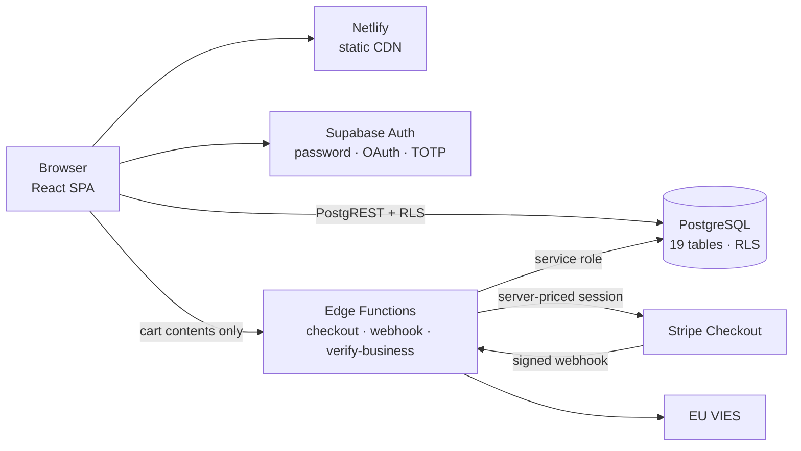

# Discusfood — Production E-Commerce Platform

A full-stack e-commerce platform for a Cyprus-based aquarium-food importer: public
storefront, B2B wholesale tier, Stripe checkout, and a 13-section warehouse back-office —
built and shipped end-to-end.

**Live:** [discusmileniumcy.com](https://discusmileniumcy.com) · **Status:** in production ·
**Built:** June – August 2026

---

## Author & Role

Designed, built and shipped **end-to-end by a single developer** — **Kuman Bazitov**
([@Kuman-Bazitov-BG](https://github.com/Kuman-Bazitov-BG)).

Every line of this system is my work: the product decisions, the React front-end, the
database schema and its row-level security model, the three Deno Edge Functions, the
Stripe integration, the admin panel, the deployment pipeline, and the documentation.
There were no other contributors, no agency, and no starter template.

| | |
|---|---|
| **Role** | Sole developer — architecture, implementation, security, deployment, handover |
| **Commits** | 114 of 114, over 11 weeks |
| **Client** | Discus Milenium — owns the product, the data and this repository |

The GitHub account that owns this repository belongs to the client. Ownership of the
repo reflects who owns the business, not who wrote the code. The commit history is the
record of authorship:

- **[Contributors graph](../../graphs/contributors)** — one name on it
- **[All commits by @Kuman-Bazitov-BG](../../commits/main?author=Kuman-Bazitov-BG)** — the full 114

---

## What it does

**Storefront (B2C)** — 94-product catalog across 6 categories with search, filtering and
detail pages; persistent cart; guest checkout; order tracking; customer reviews; a full
UI and legal document set in **English, Greek and Bulgarian**.

**Wholesale (B2B)** — business accounts register with a VAT number, which is verified
automatically against the **EU VIES** API. A valid number unlocks wholesale pricing
across the entire catalog; anything else queues the account for manual review.

**Checkout & payments** — Stripe Checkout with signed, idempotent webhooks. Shipping is
resolved from admin-managed zone/method/weight-tier tables (9 zones, 416 rate tiers)
covering real UPS Express Saver rates plus Cyprus-local AKIS delivery.

**Back-office (`/admin`)** — 13 sections: dashboard, products, categories, inventory with
stock-movement audit, orders, shipment tracking, returns, reviews, coupons, offers, gift
cards, shipping-rate management, and business-account approvals — plus cross-entity
global search.

**Security** — tiered authentication: personal accounts require an 8-character password
or Google OAuth; business and admin accounts require 12 characters and mandatory TOTP
two-factor authentication, enforced outside the router so no route renders for a
half-authenticated session.

---

## Architecture

The system has **no application server**. The browser talks directly to PostgreSQL
through PostgREST, with Row-Level Security as the authorization boundary, and drops into
Edge Functions only for the three operations that must never be trusted to a client:
pricing a cart, recording a payment, and verifying a VAT number.



**Money is never computed in the browser.** The client sends only `{ productId, quantity }`
pairs and an address. The `checkout` function re-reads every price, stock level and weight
from the database, re-resolves shipping, re-validates the coupon, and derives the price
tier from the caller's JWT — never from the request body. Every figure on the Stripe page
comes from the server's own numbers, so a tampered cart cannot change a price, unlock a
wholesale rate, or dodge a shipping charge.

**The webhook is the only writer.** Stripe's signature is verified against the raw request
bytes before anything is parsed. The handler is idempotent: a duplicate delivery hits the
unique constraint on `stripe_session_id`, is recognised by Postgres error `23505`, and
returns early — so stock is never decremented twice.

---

## Tech stack

| Layer | Technology |
|---|---|
| **Frontend** | React 19 · TypeScript 6 · Vite 8 · Tailwind CSS 4 · React Router 7 |
| **Backend** | Supabase — PostgreSQL 17, Auth, Storage · Deno Edge Functions |
| **Payments** | Stripe Checkout + signed webhooks + automatic invoicing |
| **Hosting** | Netlify (CI from `main`) · Cloudflare DNS |
| **Tooling** | ESLint 10 · Sharp + pdf-to-img image pipeline · Node E2E test harness |

No Redux, no React Query, no component library — each kind of state gets the simplest
tool that fits, and the reasoning behind that is documented in
[TECHNICAL_OVERVIEW.md](TECHNICAL_OVERVIEW.md#11-engineering-decisions).

---

## By the numbers

| | |
|---|---|
| Application code | ~13,700 lines TS/TSX |
| Edge Functions | 746 lines Deno |
| Database | 19 tables · 9 enums · **41 RLS policies** · 8 SQL functions · 44 indexes |
| Migrations | 22 versioned SQL migrations (2,342 lines) |
| Routes | 10 public · 13 admin sections |
| Languages | 3 (English, Greek, Bulgarian) — typed dictionary, missing key = compile error |
| In production | 94 products · 6 categories · 9 shipping zones · 416 weight-rate tiers |

---

## Repository layout

```text
.
├── src/                      # React SPA
│   ├── main.tsx              # Router + provider composition
│   ├── layouts/              # Storefront shell
│   ├── pages/                # 10 public routes
│   ├── components/           # Navbar, cart drawer, auth modal, MFA gate…
│   ├── admin/                # Back-office — own layout, nav, pages, data layer
│   ├── auth/                 # AuthContext, password policy, breach check
│   ├── hooks/useCart.tsx     # Cart state (Context + localStorage)
│   ├── i18n/                 # 3-language dictionary + legal documents
│   └── lib/                  # supabase client, pricing, shipping, tracking
├── supabase/
│   ├── functions/            # 3 Deno Edge Functions
│   └── migrations/           # 22 versioned SQL migrations
├── scripts/                  # Image pipeline + end-to-end fulfilment test harness
├── server/                   # Legacy Express API — retained, NOT deployed
├── public/                   # Static assets, _headers, _redirects, sitemap, robots
└── netlify.toml              # Build config + build-time env
```

> **On `server/`:** an early Express + Drizzle back-end from the first weeks of the
> project. The architecture moved to Edge Functions, which removed the need for a server
> to operate and pay for. The directory is kept for its database seeding and storage
> setup scripts; it is not built, not deployed, and not part of the running system.

---

## Running it locally

```bash
npm install
cp .env.example .env      # fill in your Supabase URL + publishable key
npm run dev               # http://localhost:5173
```

The storefront talks to Supabase directly, so there is no back-end to start. Pointing
`.env` at a Supabase project that has the migrations in `supabase/migrations/` applied is
enough for a working local instance.

| Command | Description |
|---|---|
| `npm run dev` | Vite dev server |
| `npm run build` | Type-check (`tsc -b`) then production build |
| `npm run preview` | Serve the production build locally |
| `npm run lint` | ESLint across the repo |
| `npm run test:fulfillment` | End-to-end harness: paid → shipped → delivered |

---

## Environment variables

Only public values live in the front-end environment. Vite exposes every `VITE_*`
variable to the browser, so secrets never go here — Row-Level Security is what protects
the data, not obscurity.

| Variable | Where | Notes |
|---|---|---|
| `VITE_SUPABASE_URL` | `.env` locally, `netlify.toml` in CI | Public by design |
| `VITE_SUPABASE_ANON_KEY` | `.env` locally, `netlify.toml` in CI | Publishable key; RLS enforces access |

Server-side secrets (`SUPABASE_SERVICE_ROLE_KEY`, `STRIPE_SECRET_KEY`,
`STRIPE_WEBHOOK_SECRET`) are held as Supabase Edge Function secrets and never enter the
repository or the bundle. All `.env` files are git-ignored.

---

## Deployment

Netlify builds and publishes automatically on every push to `main`. Edge Functions deploy
separately via the Supabase CLI. Operational procedures — DNS, Stripe keys, secrets
rotation, troubleshooting — are documented in [HANDOVER.md](HANDOVER.md).

---

## Documentation

| Document | For whom |
|---|---|
| [TECHNICAL_OVERVIEW.md](TECHNICAL_OVERVIEW.md) | An engineer who has never seen this repo — architecture, database, security model, and the reasoning behind each decision |
| [HANDOVER.md](HANDOVER.md) | The site owner — operations runbook |

---

## License & ownership

Private commercial project — **all rights reserved**.

The source code and the business it serves are the property of **Discus Milenium**. This
repository is published for portfolio and review purposes with the owner's permission.
No license to use, copy, modify or redistribute the code is granted.
