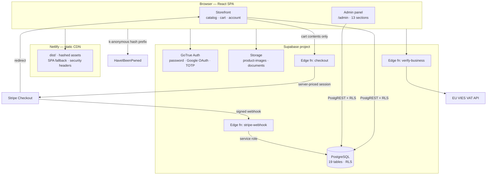
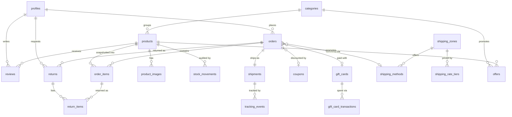

# Discusfood — Technical Overview

A production e-commerce platform for a Cyprus-based aquarium-food importer, built and
shipped end-to-end: storefront, checkout, payments, warehouse admin panel, database,
security model and deployment pipeline.

**Live:** https://discusmileniumcy.com · **Status:** in production · **Built:** June – August 2026

> This document describes what the system is made of, how it is put together, and why
> each decision was taken. It is written to be read by an engineer who has never seen
> the repository before.

---

## 1. At a glance

| | |
|---|---|
| **Type** | Full-stack e-commerce (B2C storefront + B2B wholesale + back-office) |
| **Architecture** | Serverless — static SPA + Postgres + Edge Functions. No application server to operate. |
| **Frontend** | React 19 · TypeScript 6 · Vite 8 · Tailwind CSS 4 · React Router 7 |
| **Backend** | Supabase (PostgreSQL 17 + Auth + Storage + Realtime) · Deno Edge Functions |
| **Payments** | Stripe Checkout + signed webhooks + automatic invoicing |
| **Hosting** | Netlify (CI from `main`) · Cloudflare DNS |
| **Code** | ~13,700 lines TS/TSX (app) · 746 lines Deno (edge) · 2,342 lines SQL (migrations) |
| **Database** | 19 tables · 9 enums · 41 RLS policies · 8 SQL functions · 44 indexes · 22 migrations |
| **Scale in production** | 94 products · 6 categories · 9 shipping zones · 416 weight-rate tiers |
| **Languages** | English · Greek · Bulgarian (full UI + legal documents) |
| **History** | 113 commits over 11 weeks, single developer |

---

## 2. System architecture

The system deliberately has **no application server**. The browser talks directly to
Postgres through PostgREST with Row-Level Security as the authorization boundary, and
drops into Edge Functions only for the three operations that must not be trusted to a
client: pricing a cart, recording a payment, and verifying a VAT number.



### The two flows that matter

**Checkout — money is never computed in the browser.**

```
Cart ──► checkout fn ──► re-reads every product price from the DB
                     ──► re-resolves shipping from the admin rate tables
                     ──► re-validates the coupon
                     ──► decides retail vs wholesale from the caller's JWT
                     ──► creates the Stripe session from ITS OWN numbers
```

The client sends only `{ productId, quantity }` pairs and an address. Every figure that
appears on the Stripe page is recomputed server-side. A tampered cart cannot change a
price, unlock a wholesale rate, or dodge a shipping charge.

**Order recording — the webhook is the only writer.**

Stripe calls `stripe-webhook`, whose signature is verified against the raw request body
before anything is parsed. Only then is the order written, stock decremented and the
coupon redemption counted. Because Stripe retries failed deliveries, the handler is
**idempotent**: a duplicate `checkout.session.completed` hits the unique constraint on
`stripe_session_id`, is recognised by Postgres error code `23505`, and returns early —
so stock is never decremented twice.

---

## 3. Repository layout

```
Discus Fish/
├── src/                          # React SPA (13.7k lines)
│   ├── main.tsx                  # Router + provider composition
│   ├── layouts/                  # Storefront shell
│   ├── pages/                    # 10 public routes
│   ├── components/               # Navbar, cart drawer, auth modal, MFA gate…
│   ├── admin/                    # Back-office — its own layout, nav, pages, data layer
│   │   ├── AdminLayout.tsx       # Route guard + responsive sidebar/drawer
│   │   ├── pages/                # 13 admin sections
│   │   ├── components/           # Global search, page search, shared UI primitives
│   │   └── lib/                  # Admin data access + cross-entity search
│   ├── auth/                     # AuthContext, password policy, HIBP check
│   ├── hooks/useCart.tsx         # Cart state (Context + localStorage)
│   ├── i18n/                     # 3-language dictionary + legal documents
│   ├── lib/                      # supabase client, api, pricing, shipping, tracking
│   └── types.ts
├── supabase/
│   ├── functions/                # 3 Deno Edge Functions
│   └── migrations/               # 22 versioned SQL migrations
├── scripts/                      # Node tooling: image pipeline + E2E test harness
├── server/                       # Legacy Express API — retained, NOT deployed (§11)
├── public/                       # Static assets, _headers, _redirects, sitemap, robots
├── netlify.toml                  # Build config + build-time env
├── HANDOVER.md                   # Operations runbook for the site owner
└── TECHNICAL_OVERVIEW.md         # This file
```

---

## 4. Frontend

### Composition

`main.tsx` composes four providers around the router, in dependency order:

```
LanguageProvider → AuthProvider → MfaGate → CartProvider → BrowserRouter
```

`MfaGate` sits *outside* the router on purpose: an account that owes a second factor is
stopped before any route renders, so there is no window in which a half-authenticated
session can reach a page.

### Routing

| Public | Admin (`/admin/*`) |
|---|---|
| `/` home · `/why-us` · `/contact` | `/` dashboard |
| `/Cataloge/Products` + `/:slug` | products · categories · inventory · reviews |
| `/Cataloge/NewProductsComingsoon` | orders · tracking · returns |
| `/shipping-prices` · `/tracking-delivery` | coupons · offers · gift-cards |
| `/checkout/success` | shipping (zones, methods, weight tiers) |
| `/terms` · `/privacy` · `/refund-policy` | business-accounts · search |
| `*` → 404 | |

Admin routes are gated in `AdminLayout` on `profile.role === 'admin'`. That gate is a
**convenience, not the security boundary** — the real enforcement is RLS in Postgres, so
an attacker who bypasses the React guard still gets nothing back from the database.

### State management

No Redux, no React Query — deliberately. The app has three kinds of state and each gets
the simplest tool that fits:

| State | Mechanism | Why |
|---|---|---|
| Session + profile | `AuthContext` over `supabase.auth` | One subscription to `onAuthStateChange`, shared app-wide |
| Cart | `CartContext` + `localStorage` | Survives reloads; a single provider means the navbar badge, drawer and success page can never disagree |
| Server data | Per-page `useEffect` fetch | Pages are independent; a cache layer would add invalidation bugs for no benefit at this size |

### Internationalisation

A typed dictionary (`translations.ts`, 1,411 lines) with `TranslationKey` as a union type
— a missing or misspelled key is a **compile error**, not a blank string at runtime.
Language is resolved from `localStorage`, then the browser locale, then English, and is
written to `document.documentElement.lang` for screen readers and SEO. Legal documents
(terms, privacy, refunds) live in a separate 888-line module with a single `COMPANY`
constant driving the company details across all three languages.

### Styling

Tailwind CSS 4 via the official Vite plugin (no PostCSS config), dark slate/cyan palette,
mobile-first. The admin panel uses a shared primitive set (`admin/components/ui.tsx`) so
13 pages stay visually consistent without a component library dependency.

---

## 5. Edge Functions

All three run on Deno with `--no-verify-jwt`, because their callers — guests and Stripe —
do not carry a Supabase JWT. **Authorization is done inside each function instead**, which
is stricter than the platform default, not weaker.

### `checkout` (439 lines)

The most security-sensitive code in the project. It:

1. Derives the price tier from the **`Authorization` header**, never the request body — a
   spoofed `userId` cannot unlock wholesale prices.
2. Re-reads `price_cents` / `business_price_cents`, `is_active`, `is_coming_soon`,
   `stock`, `track_inventory` and `weight_grams` from the database for every line.
3. Rejects inactive, coming-soon, or under-stocked products before Stripe is touched.
4. Re-resolves shipping from the same zone/method/tier tables the storefront reads,
   mirroring `src/lib/shipping.ts` exactly so the charge always equals the cart.
5. Re-validates the coupon (window, redemption cap, minimum order) and mints a one-off
   Stripe coupon for the exact computed amount, so percent and fixed discounts land on
   the same total.
6. Constrains the post-payment redirect to localhost or the canonical domain — closing
   the open-redirect hole a naive `origin` echo would create.
7. Enables Stripe invoice creation with the business account's company and VAT number as
   custom fields.

It also serves a lightweight `action: 'validate-coupon'` request, so the cart can preview
a discount using the *same validation code* that will run at payment — one implementation,
no drift between preview and charge.

### `stripe-webhook` (195 lines)

Signature-verified, idempotent order recorder. Verifies against the **raw body bytes**
(`constructEventAsync` on a `Uint8Array`) — parsing first would invalidate the signature.
Writes the order and its snapshotted line items, decrements tracked inventory, logs a
`stock_movements` row with reason `sale`, and increments coupon redemptions. Inventory and
coupon updates are best-effort and wrapped so a failure there can never lose the order.

### `verify-business` (112 lines)

Automatic B2B onboarding. Reads the caller's own identity from their JWT, parses their VAT
number (handling the VIES `GR`→`EL` quirk), and queries the EU VIES REST API behind an
8-second `AbortController` timeout. A valid VAT flips `business_status` to `approved` and
wholesale prices unlock immediately; anything else leaves the account `pending` for manual
review. It can only ever *promote* — it never downgrades an admin's decision, and it only
ever touches the caller's own row.

---

## 6. Database

### Entity model



### Tables by domain

| Domain | Tables |
|---|---|
| **Catalog** | `products`, `categories`, `product_images`, `stock_movements` |
| **Sales** | `orders`, `order_items`, `returns`, `return_items`, `reviews` |
| **Fulfilment** | `shipments`, `tracking_events` |
| **Shipping rates** | `shipping_zones`, `shipping_methods`, `shipping_rate_tiers` |
| **Marketing** | `coupons`, `offers`, `gift_cards`, `gift_card_transactions` |
| **Identity** | `profiles` (1:1 with `auth.users`) |

### Modelling decisions worth pointing at

**Money is integers, always.** Every amount is `*_cents integer`. No floats touch a price
anywhere in the stack — TypeScript, SQL or Stripe.

**Line items are snapshots.** `order_items` stores `name` and `unit_price_cents` at the
moment of purchase, and its FK to `products` is `on delete set null`. A product can be
renamed, repriced or deleted and a two-year-old invoice still reads correctly.

**Status is an enum, never free text.** Nine enums (`fulfillment_status`, `delivery_status`,
`review_status`, `return_status`, `stock_reason`, `gift_card_status`, `discount_type`,
`user_role`, `account_type`) push invalid states out of the realm of possible bugs. When
the delivery pipeline was first driven end-to-end, `shipments.status` and
`tracking_events.status` were still `text` — the hardening migration promoted them to a
real `delivery_status` enum, which required dropping and restoring the column default
around the type change.

**Human-readable order numbers.** `order_number` defaults to `'DF-' || nextval(seq)` — the
customer quotes `DF-1042`, the system still keys on a UUID.

**Invariants live in the schema, not in application code:**

```sql
-- Exactly one admin account can ever exist, enforced by Postgres.
CREATE UNIQUE INDEX only_one_admin ON profiles ((role = 'admin')) WHERE role = 'admin';

-- One shipment per order — a second one would be invisible to the customer.
ALTER TABLE shipments ADD CONSTRAINT shipments_order_id_key UNIQUE (order_id);

-- Ratings cannot be out of range.
CHECK (rating >= 1 AND rating <= 5)
```

### Functions and triggers

| Object | Kind | Purpose |
|---|---|---|
| `is_admin()` | `SECURITY DEFINER`, stable | Single admin predicate used by every admin RLS policy |
| `business_prices()` | `SECURITY DEFINER`, stable | Returns wholesale prices **only** to an approved business caller |
| `admin_list_business_accounts()` | `SECURITY DEFINER` | Admin-only view over business signups |
| `admin_set_business_status()` | `SECURITY DEFINER` | Admin approve/reject, permission-checked internally |
| `handle_new_user()` | trigger on `auth.users` | Creates the `profiles` row from signup metadata |
| `auto_confirm_email()` | trigger on `auth.users` | Sign-up flow without an email round-trip |
| `touch_updated_at()` | trigger on `orders`, `returns` | Maintains `updated_at` |
| `rls_auto_enable()` | event trigger | **Any new table gets RLS enabled automatically** — a table can never be created unprotected by accident |

Every `SECURITY DEFINER` function pins `SET search_path TO 'public'`, closing the classic
search-path privilege-escalation vector.

### Performance

44 non-primary-key indexes, placed against real query shapes rather than sprinkled: the
admin order list (`orders_created_at_idx`, `orders_status_idx`, `orders_fulfillment_idx`),
customer lookups (`orders_email_idx`, `orders_user_idx`), every foreign key used in a
join, and partial indexes for the hot filters (`products_active_idx`,
`products_coming_soon_idx`, `offers_active_idx`). RLS policies were later rewritten to
wrap `auth.uid()` in a scalar subselect so Postgres evaluates it **once per query instead
of once per row** — a Supabase advisor finding fixed in a dedicated migration.

---

## 7. Security model

Security here is layered, and each layer assumes the one above it has failed.

### 1 — Authorization lives in the database

41 RLS policies across all 19 tables, following one consistent shape:

```sql
-- Public reads only what is meant to be public
CREATE POLICY products_public_read ON products FOR SELECT USING (is_active);

-- Owners read only their own rows
CREATE POLICY orders_owner_read ON orders FOR SELECT USING (user_id = auth.uid());

-- Admin gets everything, through one auditable predicate
CREATE POLICY orders_admin_all ON orders FOR ALL USING (is_admin());
```

A user cannot promote themselves to admin: no `UPDATE` policy on `profiles.role` exists at
all. Creating an admin requires SQL-editor access to the project.

### 2 — Never trust the client with money or identity

- Prices, shipping and discounts are recomputed server-side on every checkout.
- The price tier comes from the verified JWT, never from a request body field.
- Coupon rules are enforced in the Edge Function; the browser never receives the coupon table.
- Wholesale prices reach the browser only through `business_prices()`, which returns an
  empty set to anyone who is not an approved business account.

### 3 — Authentication, tiered by risk

| Account | Minimum password | Second factor |
|---|---|---|
| Personal | 8 chars + leaked-password check + strength meter | — |
| Business | 12 chars | **Mandatory TOTP** |
| Admin | configurable (`ADMIN_SECURITY_EXEMPT`) | configurable |

Password strength uses `zxcvbn-ts` (entropy-based, not a regex checklist). The
leaked-password check calls HaveIBeenPwned using **k-anonymity**: the password is SHA-1
hashed in the browser and only the first five hex characters ever leave the device, with
`Add-Padding: true` so a network observer cannot infer the match count from response size.
It fails *open* — a HIBP outage can never block a legitimate signup.

Google OAuth is offered alongside password sign-in. Password recovery is handled through a
distinct `PASSWORD_RECOVERY` session state that forces the reset screen and suppresses the
MFA gate until the new password is set.

### 4 — Transport and browser hardening

`public/_headers` ships HSTS with preload, `X-Frame-Options: DENY`, `nosniff`,
`strict-origin-when-cross-origin`, a `Permissions-Policy` disabling camera/mic/geo/USB, and
a Content-Security-Policy allow-listing exactly four origins. The CSP is deployed
**report-only first** — a wrong CSP breaks a site silently, so it is observed in production
before being promoted to enforcing.

### 5 — Privacy by design

No analytics, no third-party pixels, no tracking cookies — so no consent banner is
required, and there is nothing to leak. The trade-off (and what adding analytics would
cost legally) is documented in the handover runbook rather than left for a future
maintainer to rediscover.

---

## 8. Business logic

Three subsystems carry most of the domain complexity.

### Dual pricing with automated B2B verification

Retail and wholesale prices live side by side (`price_cents`, `business_price_cents`).
Which one a customer sees is decided in three places that must agree — and each derives it
from the same authenticated identity:

- **Catalog:** `business_prices()` RPC overlays wholesale prices; returns nothing to anyone else.
- **Cart:** priced from the overlaid catalog.
- **Checkout:** re-derived from the JWT, independent of anything the client sent.

Onboarding is automatic: sign up as a business → VAT checked against EU VIES → approved in
seconds, or queued for the owner if VIES is unreachable or the number is invalid.

### Weight-based international shipping

Real UPS Express Saver tariffs, modelled as data rather than code — **416 rate tiers across
9 zones**, all editable in the admin panel with no deploy:

```
billable weight = Σ(product net weight × qty) + 250 g packaging tare
price           = first tier whose max_weight_grams covers it
                  ↓ above the heaviest tier
                  top tier price + ⌈excess kg⌉ × zone per-kg surcharge
```

Cyprus is a domestic zone with its own rules (AKIS courier): office pickup is free up to a
net-weight threshold and a flat fee above it; home delivery is flat. Country → zone
resolution prefers a zone that explicitly lists the country and falls back to the
empty-countries "rest of world" zone.

The same resolution runs twice — `src/lib/shipping.ts` for the cart and the `checkout`
function for the charge. That duplication is intentional (the browser must price the cart
without a round-trip, the server must never trust the browser) and the one shared constant
that can drift, `PACKAGING_TARE_GRAMS`, is flagged in both files and in the runbook.

### Fulfilment pipeline

```
paid → label_created → on_the_way → out_for_delivery → delivered
                                  ↘ access_point    ↘ exception
```

The admin sets the stage and appends `tracking_events`; the customer sees the same timeline
on `/tracking-delivery`, restricted by RLS to their own orders. Returns run their own state
machine (`requested → approved/rejected → received → refunded`) with line-item granularity.
Inventory is never adjusted silently: every change writes a `stock_movements` row with a
typed reason (`sale`, `return`, `restock`, `correction`, `cancellation`, `manual`) and the
actor who made it.

---

## 9. Build, deploy, operate

| Stage | Mechanism |
|---|---|
| **Build** | `tsc -b && vite build` — the type check gates the bundle |
| **Frontend deploy** | `git push` → Netlify builds from `main` and publishes. Node pinned to 22 in `netlify.toml`. |
| **Edge functions** | `supabase functions deploy <name> --no-verify-jwt` — versioned separately from the frontend by design |
| **Database** | `supabase migration list --linked` then `db push --linked` — 22 forward-only migrations |
| **Secrets** | Supabase function secrets (`STRIPE_SECRET_KEY`, `STRIPE_WEBHOOK_SECRET`, `CLIENT_URL`). Only the two public Supabase values are ever in the repo. |
| **Caching** | Hashed `/assets/*` served `immutable, max-age=31536000`; `index.html` always revalidated |
| **SPA routing** | `_redirects` rewrites all paths to `index.html` with status 200 (not a 301) so deep links keep their URL |

Every migration file opens with a comment explaining *what was found and why the change is
needed* — not just what it does. Example, from the fulfilment hardening migration:

> `tracking_events.occurred_at` is a dead duplicate of `event_at`. Nothing writes it and
> nothing reads it… It silently takes the row's INSERT time, so the moment anyone
> backdates an event the two columns disagree with no warning. Drop it.

`HANDOVER.md` is a full operations runbook for the non-technical owner: where every setting
lives, a symptom → first-place-to-look table, and the known-and-accepted advisor warnings
so nobody "fixes" an intentional decision later.

---

## 10. Tooling

### End-to-end fulfilment test (`scripts/test-fulfillment.mjs`, 246 lines)

A real integration test, not a mock: it **signs in as the admin account rather than using
the service-role key**, so every write travels the same RLS path the admin panel does. It
drives `paid → label_created → on_the_way → out_for_delivery → delivered`, asserts at each
stage who can see and change what, creates two throwaway users and one order, and deletes
all of it in a `finally` block. Exits non-zero on any failed assertion.

```bash
TEST_ADMIN_EMAIL=… TEST_ADMIN_PASSWORD=… npm run test:fulfillment
```

### Image pipeline

Product photography arrived as a print PDF catalogue and green-screen studio shots. Five
Node scripts turn that into web assets:

| Script | Does |
|---|---|
| `render-catalog.mjs` | Rasterises the catalogue PDF → 111 page PNGs (`pdf-to-img`) |
| `optimize-catalog.mjs` / `thumb-catalog.mjs` | PNG → WebP + thumbnails (`sharp`) |
| `crop-product.mjs` | Extracts packaging shots from catalogue pages |
| `remove-chroma-key.mjs` | Chroma-key removal → transparent product PNGs |

### Code quality

ESLint 10 flat config with `typescript-eslint`, `react-hooks` and `react-refresh`.
TypeScript is split into project references (app / build tooling), with `noUnusedLocals`,
`noUnusedParameters`, `noFallthroughCasesInSwitch` and `verbatimModuleSyntax` enabled, and
the build gated behind `tsc -b`. Dependencies are kept on current majors — React 19, Vite 8, Tailwind 4, ESLint 10 — with
the two persistent dev-only advisories documented rather than force-fixed.

---

## 11. Engineering decisions

The choices below are the ones a reviewer is most likely to question. Each is recorded
with its trade-off.

| Decision | Why | What was rejected |
|---|---|---|
| **No application server** | Nothing to patch, scale or pay for; the DB enforces authorization anyway | The Express API in `server/` — built first, then removed from the path once RLS + Edge Functions covered it. Kept in-repo, documented as *not deployed*, so nobody points a webhook at it |
| **RLS as the authorization boundary** | One place to reason about access; a client bug cannot leak data | Application-layer checks, which have to be repeated in every endpoint |
| **Shipping rates as data, not code** | The owner changes prices without a developer or a deploy | Hard-coded tariff tables |
| **Duplicate shipping logic client + server** | The cart must price instantly; the server must never trust the cart | Shared package — over-engineering for two files, when the real fix is documenting the one constant that can drift |
| **Integer cents everywhere** | Float arithmetic on money is a defect waiting to happen | `numeric`, decimal libraries |
| **Snapshotted line items** | Historic invoices must not change when a product does | Joining live product rows at read time |
| **CSP report-only first** | A wrong CSP breaks the site silently and blames nothing | Shipping it enforcing and finding out from customers |
| **Enums over text status** | Invalid states become impossible instead of merely unlikely | `text` + application validation |
| **Client-side HIBP check** | Supabase's built-in leaked-password protection is Pro-only; this keeps the guarantee on the Free plan | Paying for Pro before there was revenue — and the gap (a direct GoTrue call bypasses it) is written down, not hidden |
| **Context over Redux/React Query** | Three kinds of state, three simple mechanisms; no invalidation layer to get wrong | A caching library whose complexity exceeds the problem |
| **Admin panel in the same SPA** | One auth session, one deploy, one design system | A separate admin app |

---

## 12. Skills demonstrated

| Area | Evidence in this repository |
|---|---|
| **Full-stack TypeScript** | 13.7k lines of typed React 19 + TS 6 across storefront, admin and Deno edge runtime |
| **Relational data modelling** | 19 tables, 9 enums, FK strategy chosen per relationship (`cascade` vs `set null`), invariants enforced by constraints and partial unique indexes |
| **SQL & Postgres** | 22 hand-written migrations, `SECURITY DEFINER` functions with pinned `search_path`, event triggers, enum type migrations with default juggling, RLS `initplan` optimisation |
| **Application security** | 41 RLS policies, JWT-derived authorization, webhook signature verification, server-side price recomputation, open-redirect prevention, CSP/HSTS, k-anonymous breach checks, TOTP MFA |
| **Payments integration** | Stripe Checkout, idempotent webhook handling, dynamic one-off coupons, automatic invoicing with B2B custom fields |
| **Third-party integration** | EU VIES VAT validation with timeout handling and graceful degradation, HaveIBeenPwned, Google OAuth |
| **Domain modelling** | Real UPS tariffs as 416 admin-editable rate tiers, dual retail/wholesale pricing, VAT-inclusive breakdowns, multi-state fulfilment and returns machines |
| **Frontend engineering** | React 19 patterns, provider composition, type-safe i18n across 3 languages, responsive admin with cross-entity global search, accessible drawers and modals |
| **DevOps** | CI-from-git deploys, environment/secret separation, edge-function versioning, cache and SPA-routing headers, Node version pinning |
| **Testing** | RLS-faithful E2E harness that signs in as a real user rather than bypassing security with a service key |
| **Engineering judgement** | Decisions documented with their trade-offs; known gaps written down instead of hidden; a legacy subsystem retired safely and labelled rather than silently left to rot |
| **Communication** | An operations runbook written for a non-technical owner; migrations that explain the problem before the fix |

---

## 13. Running it locally

```bash
npm install
cp .env.example .env          # VITE_SUPABASE_URL, VITE_SUPABASE_ANON_KEY
npm run dev                   # http://localhost:5173

npm run build                 # type-check + production bundle
npm run lint
npm run test:fulfillment      # E2E fulfilment flow (see §10)
```

---

<sub>Design, architecture, implementation, database, security and deployment by a single developer, June–August 2026.</sub>
